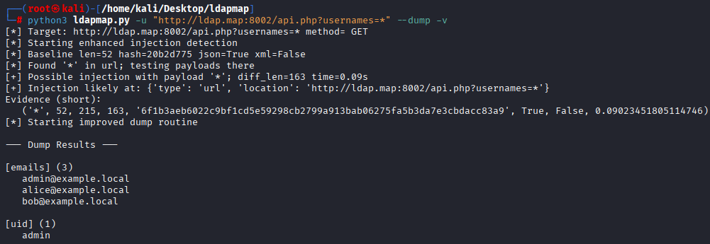
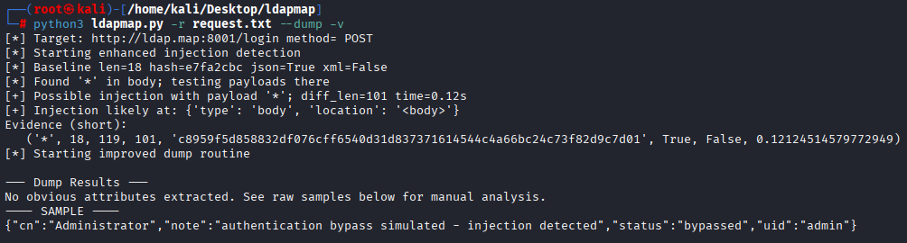

# LDAPMap — LDAP Injection Toolkit

<p align="center">
  
</p>

<p align="center"><b>LDAPMap is a lightweight LDAP Injection discovery & PoC toolkit.</b></p>

## ⚠️ Legal / Ethical

> This tool is for **authorized penetration testing** and educational use only.  
> Do **NOT** use LDAPMap against systems without **written permission**.

## Features

- Heuristic detection with expanded LDAP payload set + encodings  
- Response fingerprinting → `Length + SHA256`  
- Format detection → JSON / XML / HTML  
- `--dump` → extract emails, uid, cn, dn via structured parsing  
- `--charbrute` → time-based / diff-based char-by-char extraction  
- Rate limiting / delay (`--rate`, `--delay`) and proxy support (`--proxy`)  
- Raw request file support (`-r`) similar to sqlmap  
- Output to JSON (`--output results.json`)

> Note: Blind/time-based reliability depends on target behavior; v0.2 implements plumbing & heuristics.

## Quick Start

### 1) Install

```bash
git clone https://github.com/furkan1x337/ldapmap.git
cd ldapmap
chmod +x ldapmap.py
python3 -m pip install requests
```

### 2) Heuristic dump

```bash
python3 ldapmap.py -u "http://127.0.0.1:8002/api.php?usernames=*" --dump
```


### 3) Raw request file (POST body)
Create examples/req-auth.txt:

```makefile
POST /login HTTP/1.1
Host: 127.0.0.1:8001
Content-Type: application/x-www-form-urlencoded

username=*&password=whatever
```

Run:

```bash
python3 ldapmap.py -r examples/req-auth.txt --dump
```


#### Usage
```text
usage: ldapmap [-h] (-u URL | -r REQ) [--dump] [--charbrute ATTR]
               [--maxlen N] [--chars ABC...] [--blind-mode {time,diff}]
               [--blind-time SEC] [--rate RPS | --delay SEC]
               [--proxy URL] [--timeout SEC] [-v] [--insecure]
               [--output FILE]
Common flags
-u/--url — target URL; put * at the injection point

-r/--req — raw HTTP request file (use * in URL or body)

--dump — heuristic extraction (emails/uid/cn/dn)

--charbrute ATTR — char-by-char extraction for attribute (heuristic)

--blind-mode time|diff — choose blind extraction mode

--blind-time SEC — timing threshold for time-based mode

--rate RPS / --delay SEC — throttling

--proxy URL — http://127.0.0.1:8080 for Burp/mitmproxy

--insecure — disable TLS verification for lab testing

--output FILE — write structured JSON output
```

#### Examples

Time-based char brute:

```bash
python3 ldapmap.py -u "http://127.0.0.1:8000/api.php?usernames=*" \
  --charbrute uid --maxlen 16 --blind-mode time --blind-time 1.5 \
  --chars "abcdefghijklmnopqrstuvwxyz0123456789_-" -v
```

Diff-based char brute:

```bash
python3 ldapmap.py -u "http://127.0.0.1:8000/api.php?usernames=*" \
  --charbrute uid --blind-mode diff -v
```
Rate-limit & proxy (Burp):

```bash
python3 ldapmap.py -u "http://127.0.0.1:8000/?q=*" --proxy http://127.0.0.1:8080 --rate 2 --insecure -v
```
## License
This project is licensed under the GPL-3.0 License - see the LICENSE file for details.
